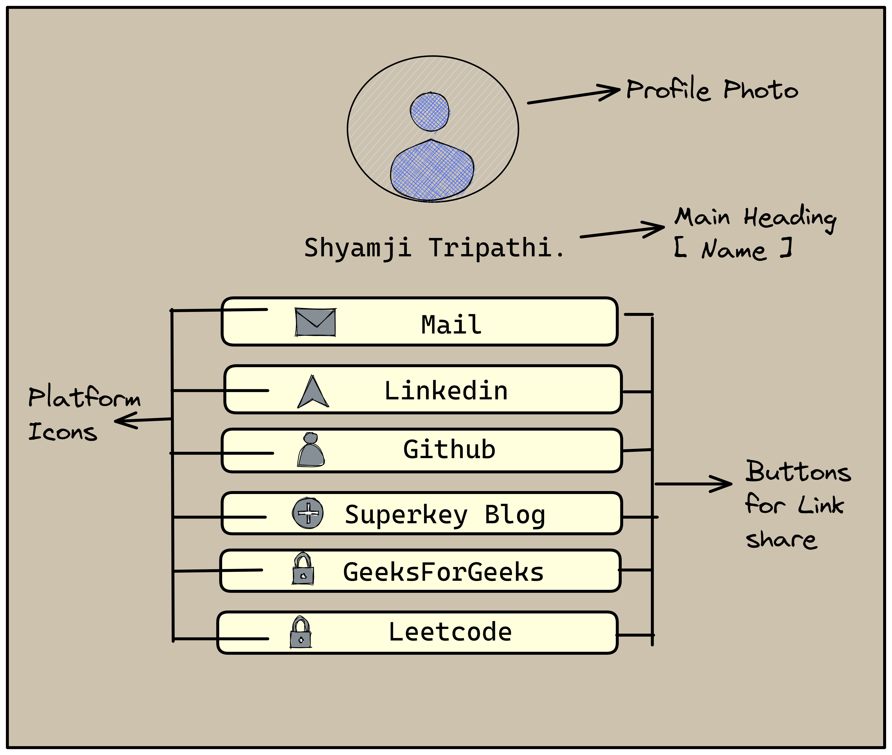
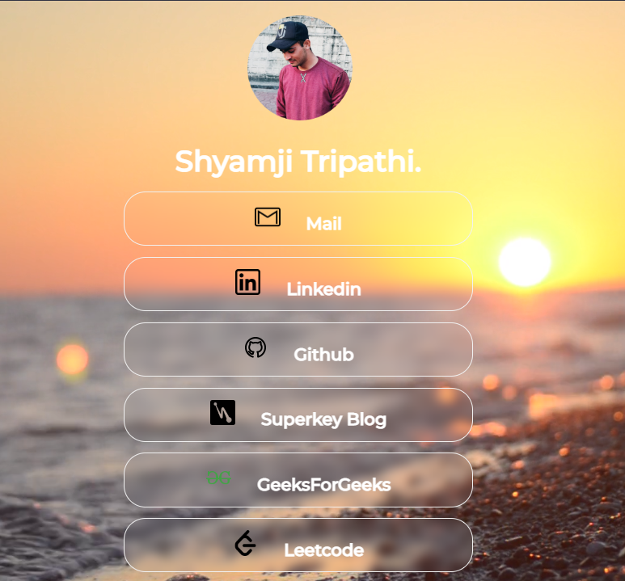

# ProfileLinkshare
[Live link of website](https://shyamjitripathi.github.io/ProfileLinkshare/)<br>
<br>
As a developer, we use various platform for our use and when we want to share their links in one place we take help of sites like [BioLink](https://bio.link/), [Linktree](https://linktr.ee/) and many more. <br>
So, one day I was scrolling Linkedin and was attracted by this biolink profile [Roadsidecoder](https://bio.link/roadsidecoder) and I decided to build the same thing for me which will have same appearance without a tracker. 

## Step 1: Design layout



## Step 2: Tech stack
```
1. HTML
2. CSS
```
## Step 3: Outside-help

* Error page design from ["Carla"](https://codepen.io/ckroll17)
* Background Video from  ["Pexel"](https://www.pexels.com/video/ground-level-footage-of-waves-breaking-on-the-shore-with-the-sun-setting-in-the-horizon-3099522/)

## Step 4: Coding overview
```
<div class="home">                         "Parent Div"
  <div class="overlay">                    "Masking layer between parent and home-content"
     <div class="home-content">            "Div holding content"
     </div>
  </div
</div>
```

## Final Result


